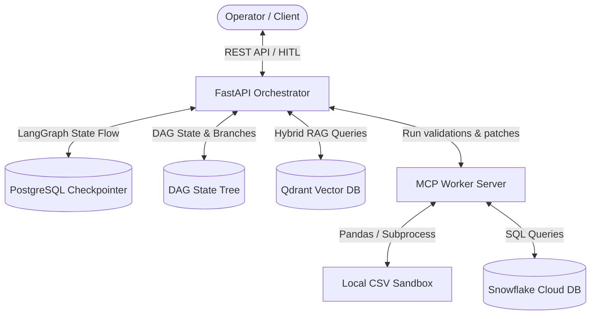

# Agentic DataOps Orchestrator with Time-Travel Debugging

A production-grade Agentic DataOps pipeline built with **FastAPI**, **LangGraph**, **PostgreSQL (PostgresSaver)**, and **Qdrant (Deterministic Hybrid RAG)**. This system features a branching DAG engine for state management, human-in-the-loop (HITL) approval gates, and time-travel debugging capabilities.

---

## 🏗️ System Architecture



The system is organized into five specialized layers:

1. **Layer 1: The Brain (Orchestrator)** - FastAPI & LangGraph orchestrating pipeline transitions and handling Human-In-The-Loop approvals.
2. **Layer 2: Computational Arms (MCP Worker)** - Executes data validation, Pandas/SQL transformations, and applies data patches.
3. **Layer 3: Vector Knowledge (Qdrant)** - Performs deterministic RAG searches to retrieve isolated domain-specific quality rules.
4. **Layer 4: Persistent Memory (PostgreSQL)** - Stores transaction logs, LangGraph checkpoint states, and the branching state node tree.
5. **Layer 5: Branch Inspector (Adminer)** - A database administration UI for inspecting nodes and parent-child transitions.

---

## 📁 Repository Structure

```text
agentic_data_ops/
├── docker-compose.yml          # Main container orchestrator configuration
├── ReadMe.txt                  # Original text instructions (translated)
├── README.md                   # System documentation and guides
│
├── orchestrator/               # FastAPI + LangGraph Orchestrator
│   ├── Dockerfile
│   ├── requirements.txt
│   ├── init/                   # RAG Initialization
│   │   ├── Dockerfile
│   │   ├── requirements.txt
│   │   └── rag_indexer.py      # Script to embed and index business rules in Qdrant
│   └── src/
│       ├── app.py              # Web server, REST endpoints & Time-Travel logic
│       ├── graph.py            # LangGraph state machine & router
│       ├── database.py         # PostgresSaver connection pool manager
│       └── dag_state_manager.py# Postgres-backed branching state tree manager
│
├── mcp_worker/                 # Computation Sandbox Worker
│   ├── Dockerfile
│   ├── requirements.txt
│   ├── server.py               # MCP HTTP Server (validations, transforms, patches)
│   ├── core/                   # Processing logic
│   │   ├── validate.py         # Checks data against active schema rules
│   │   └── transform.py        # Applies pandas-based bonus calculations
│   └── data/                   # Data directory containing active buffer files
│       └── stage_buffer.csv
│
└── shared_store/               # Shared volume on disk (for RAG and Checkpoints)
    ├── business_rules.json     # Data contracts and restoration policies
    └── architecture_notes.txt  # Project design notes
```

---

## 🚀 Getting Started

### Prerequisites
- Docker & Docker Compose installed.
- A Gemini API Key configured in your environment.

### 1. Launch Services
Create a `.env` file in the root directory:
```env
GEMINI_API_KEY=your_gemini_api_key_here
POSTGRES_DB=dataops_checkpoints
POSTGRES_USER=caedatallc_admin
POSTGRES_PASSWORD=SecretPassword2026
```

Build and run the stack:
```bash
# Tear down old assets and volumes
docker-compose down -v

# Build and launch all services
docker-compose up --build
```

### 2. Initialize Qdrant Business Rules
Run the indexing tool to bootstrap the hybrid dense/sparse RAG collection:
```bash
docker build -t dataops_init_indexer ./orchestrator/init
docker run --rm \
  --network agentic_data_ops_dataops_network \
  --env-file .env \
  -v $(pwd)/shared_store:/app/store \
  dataops_init_indexer
```

---

## 🔍 API Testing & Verification

### 1. Start the DataOps Pipeline
```bash
curl -X POST "http://localhost:8000/api/v1/pipeline/start" \
  -H "Content-Type: application/json" \
  -d '{"max_retries": 3}'
```
*This will run validations, discover data anomalies (such as non-numeric salary values), trigger the AI analyst to search the Qdrant sub-graph for a repair rule, generate a patch, and halt at the human-in-the-loop gate.*

### 2. Human-In-The-Loop Approval (HITL)
If the AI-proposed patch is correct, approve it:
```bash
curl -X POST "http://localhost:8000/api/v1/pipeline/approve" \
  -H "Content-Type: application/json" \
  -d '{
    "thread_id": "<THREAD_ID_FROM_START>",
    "approved": true,
    "comment": "Salary patch is correct, department code is filled"
  }'
```

---

## 🌳 Time-Travel Debugging (DAG Branching)

The orchestrator registers every pipeline checkpoint as a node in a parent-linked hierarchy (`state_nodes`), allowing developers to fork execution from any historical state.

### 1. Fetch DAG History
Retrieve the node execution graph for a session:
```bash
curl -X GET "http://localhost:8000/api/v1/pipeline/history/<THREAD_ID>"
```
*Returns a JSON payload representing the state nodes, their relationships (`parent_id`), timestamps, and active branches.*

### 2. Fork an Experimental Branch
Create a new timeline branching off from any historical `node_id`:
```bash
curl -X POST "http://localhost:8000/api/v1/pipeline/fork" \
  -H "Content-Type: application/json" \
  -d '{
    "thread_id": "<THREAD_ID>",
    "from_node_id": "<HISTORICAL_NODE_ID>",
    "new_branch_name": "hypothesis/experimental_patch"
  }'
```

You can view node lineages interactively via the **Adminer UI** at [http://localhost:8080](http://localhost:8080) by logging into the PostgreSQL server using the credentials declared in your `.env` file.
