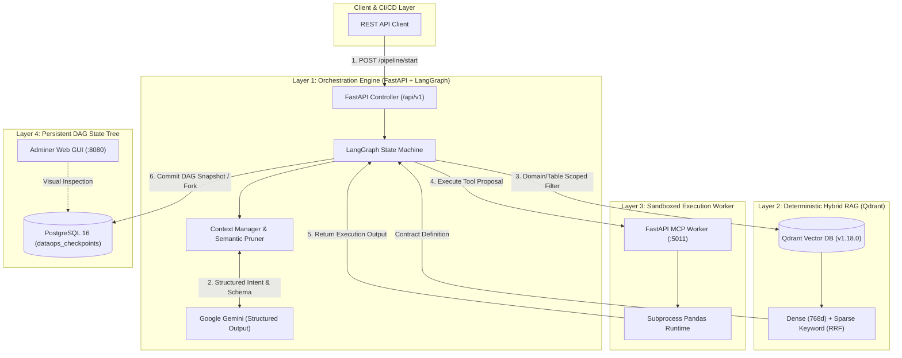

# 🛡️ CAE Data LLC — Agentic DataOps Framework

**Automated Data Quality Remediation, Deterministic Hybrid RAG & Git-like State DAG Engine**

---

## 🏛️ Architectural Context & Motivation

Integrating Large Language Models into automated data engineering workflows often fails in production due to three core architectural bottlenecks:

1. **Context Window Degradation:** Multi-round reflection and raw stack trace dumps lead to token explosion, loss of system invariants (*Lost-in-the-Middle* effect), and non-deterministic remediation loops.
2. **Cross-Domain Hallucinations:** Unconstrained vector search retrieves syntactically plausible but domain-invalid schema fixes across unrelated datasets.
3. **Linear State Lock-in:** Traditional chat-based LLM architectures maintain flat, append-only message histories, preventing rollbacks, hypothesis branching, and structured audit trails.

The **CAE Data LLC Agentic DataOps Framework** addresses these challenges by enforcing **deterministic retrieval constraints**, **strict context pruning**, **sandboxed execution runtimes**, and a **PostgreSQL-backed Directed Acyclic Graph (DAG) state engine** with Human-in-the-Loop (HITL) governance.

---

## 📐 System Architecture & Data Flow



---

## 🔬 Core Engineering Pillars

### 1. Bounded Context Management & Semantic Trace Pruning (Phase 3.1)
To prevent context saturation and maintain deterministic model behavior across iterative remediation loops:
* **Static Anchor Prompting:** Invariant business constraints, schema definitions, and system contracts remain pinned at the root of the context window.
* **Semantic Log Pruning:** Raw stack traces, deep framework frames, and voluminous payload dumps are dynamically stripped down to actionable error signatures before LLM inference.
* **Sliding Window Context:** Retains only the active anchor and the last $K$ interaction frames, strictly bounding consumption to $\sim 1,200 - 2,000$ tokens regardless of iteration count.

### 2. Scoped Sub-Graph RAG via Qdrant Hybrid Search (Phase 3.2)
To eliminate cross-domain schema bleeding and hallucinated column transformations, vector retrieval is bounded by deterministic metadata filters:

$$
Search Space = Collection \\cap\ PayloadFilter(domain, table name, target column)
$$

* **Dense Embeddings ($d=768$):** Encodes semantic transformation intent via `gemini-embedding-001`.
* **Sparse Keyword Indexing:** Captures exact SQL column identifiers and code tokens using deterministic keyword hashing.
* **Reciprocal Rank Fusion (RRF):** Merges Dense and Sparse scores natively within Qdrant:

$$
RRF Score(d) = \sum_{m \in M} \frac{1}{k + r_m(d)}
$$

### 3. Non-Linear DAG State Engine & Versioned Checkpointing (Phase 3.3)
State transitions are persisted in PostgreSQL (`dataops_checkpoints`) as a Directed Acyclic Graph (DAG) rather than a linear message thread:
* **Time-Travel Rollback:** Any historic `node_id` can be restored directly as the active `HEAD`, enabling zero-cost recovery from invalid remediation paths.
* **Hypothesis Branching (`/fork`):** Independent experimental patches (e.g., `hypothesis/schema_v2`) can be spawned and validated in isolation without mutating the `main` execution branch.
* **Preference Dataset Export:** Dead-end branches and rejected proposals are permanently retained as structured negative pairs (`Rejected`) for downstream preference alignment and offline evaluation.

---

## 🛠️ Technology Stack & Microservice Topology

| Component | Technology | Role & Boundary |
| :--- | :--- | :--- |
| **Orchestrator** | FastAPI + LangGraph + `google-genai` SDK | Workflow state machine, structured output schema enforcement (`ToolCallProposal`), HITL gating. |
| **Execution Worker** | FastAPI + Pandas + Subprocess Sandbox | Isolated execution runtime for data quality validation and deterministic patching (`fill_na`, `replace`). |
| **Vector Index** | Qdrant v1.18.0 (Rust Engine) | Hybrid Dense + Sparse RAG index with strict payload filtering. |
| **State Storage** | PostgreSQL 16 Alpine | Persistent DAG state nodes (`state_nodes`) and active branch pointers (`branch_pointers`). |
| **Database Inspection** | Adminer Web GUI | Visual verification of DAG lineages, state payloads, and branch checkpoints. |

---

## 📁 Repository Layout

```text
agentic_data_ops/
├── docker-compose.yml         # 5-service container topology
├── .env_template              # Environment variable specifications
├── orchestrator/              # Orchestration & State Machine Microservice
│   ├── Dockerfile
│   ├── requirements.txt
│   ├── init/                  # Vector index initialization scripts
│   │   └── rag_indexer.py
│   └── src/
│       ├── app.py             # FastAPI entrypoint & REST endpoints
│       ├── graph.py           # LangGraph state machine & reflection loop
│       ├── dag_state_manager.py # PostgreSQL DAG state engine
│       ├── context_manager.py # Bounded context manager & semantic pruning
│       └── database.py        # SQLAlchemy / asyncpg connection pool
├── mcp_worker/                # Sandboxed Execution Worker Microservice
│   ├── Dockerfile
│   ├── server.py              # Tool execution endpoints (:5011)
│   ├── core/                  # Safe pandas transforms & schema validators
│   └── data/                  # Test datasets & synthetic corruption frames
└── shared_store/              # Mounted volume for contracts and local checkpoints
    ├── business_rules.json    # Domain quality rules & schema specifications
    └── checkpoints.db
```

---

## 🚀 Quickstart Guide

### 1. Prerequisites & Environment Configuration
Ensure you have **Docker Engine** (24.0+) and **Docker Compose** (v2+) installed.

Clone the repository and prepare the local environment file:
```bash
git clone https://github.com/kazbek-d/agentic_data_ops.git
cd agentic_data_ops
cp .env_template .env
```

Configure your `.env` file with your Gemini API credentials and database configuration:
```ini
GEMINI_API_KEY=your_actual_gemini_api_key_here
POSTGRES_DB=dataops_checkpoints
POSTGRES_USER=caedatallc_admin
POSTGRES_PASSWORD=SecretPassword2026
```

### 2. Build & Deploy Microservices
Start all 5 containerized services:
```bash
docker compose up -d --build
```

Verify that all services are healthy:
```bash
docker compose ps
```

### 3. Initialize the Vector Knowledge Base
Index domain quality contracts into Qdrant:
```bash
docker run --rm \
  --network agentic_data_ops_dataops_network \
  -e QDRANT_HOST=qdrant \
  -e GEMINI_API_KEY=$GEMINI_API_KEY \
  -v $(pwd)/shared_store:/app/store \
  agentic_data_ops-orchestrator python /app/init/rag_indexer.py
```

---

## 🧪 API Verification & DAG Testing

### A. Start Pipeline Execution
Trigger an automated remediation session:
```bash
curl -X POST "http://localhost:8000/api/v1/pipeline/start" \
  -H "Content-Type: application/json" \
  -d '{"max_retries": 3}'
```

### B. Inspect DAG Execution Tree
Fetch the active lineage tree for a given session:
```bash
curl -X GET "http://localhost:8000/api/v1/pipeline/history/<THREAD_ID>"
```

### C. Fork Hypothesis Branch (Time-Travel)
Fork an experimental remediation branch from an existing checkpoint `node_id`:
```bash
curl -X POST "http://localhost:8000/api/v1/pipeline/fork" \
  -H "Content-Type: application/json" \
  -d '{
    "thread_id": "<THREAD_ID>",
    "from_node_id": "<NODE_ID>",
    "new_branch_name": "hypothesis/experimental_patch"
  }'
```

### D. Human-in-the-Loop Governance (HITL)
Approve or reject a proposed remediation patch:
```bash
curl -X POST "http://localhost:8000/api/v1/pipeline/approve" \
  -H "Content-Type: application/json" \
  -d '{
    "thread_id": "<THREAD_ID>",
    "approved": true,
    "comment": "Approved patch for department_id column"
  }'
```

---

## 📊 Administration Dashboards

* **FastAPI Swagger Docs:** [http://localhost:8000/docs](http://localhost:8000/docs)
* **Qdrant Vector Dashboard:** [http://localhost:6333/dashboard](http://localhost:6333/dashboard)
* **PostgreSQL Adminer GUI:** [http://localhost:8080](http://localhost:8080)
  * *Server:* `postgres`
  * *User:* `caedatallc_admin`
  * *Password:* `SecretPassword2026`
  * *Database:* `dataops_checkpoints`

---

## 📜 Authorship & Architecture

**CAE Data LLC**
* *Lead Systems Architect:* Kazbek
* *Model & Cognitive Foundations:* Google Gemini

*Designed for resilient, production-grade enterprise data automation.*
